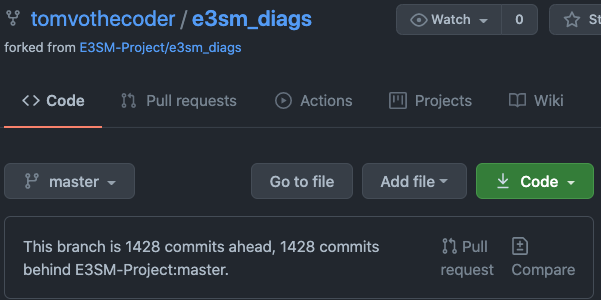

# Purge Files from Git

This page covers the process involved in purging large files from the Git history of the E3SM Diagnostics project.
These steps can be applied to any repository.

The `e3sm-diags` repo has grown to over 1 GB, making cloning very slow and cumbersome.

Resolves GitHub Issue: <https://github.com/E3SM-Project/e3sm_diags/issues/306>

## Tool of Choice: BFG Repo-Cleaner

> The BFG is a simpler, faster alternative to git-filter-branch for cleansing bad data out of your Git repository history:
>
> - Removing Crazy Big Files
> - Removing Passwords, Credentials & other Private data
>
> The git-filter-branch command is enormously powerful and can do things that the BFG can't - but the BFG is much better for the tasks above, because:
>
> - Faster : 10 - 720x faster
> - Simpler : The BFG isn't particularily clever, but is focused on making the above tasks easy
> - Beautiful : If you need to, you can use the beautiful Scala language to customise the BFG. Which has got to be better than Bash scripting at least some of the time.
>
> &mdash; <https://rtyley.github.io/bfg-repo-cleaner/>

## What to expect

- This is a disruptive action that requires close coordination with collaborators, especially with many forks and clones
- Large unnecessary OUTPUT files (e.g. `.nc`,`.png`, `pdf`, `.tar`) are purged from the repository, effectively reducing the repo's `size-pack`
- BFG rewrites Git commits, and therefore the project's Git history
  - From the first commit you rewrite, every subsequent commit will then differ and have a different hash regardless if it was rewritten or not, since the parent hash will differ from that point forward
- Git will complain about a divergence between upstream and forked repos since Git tracks commits via commit-hashes
  - If any factor in a commit changes, the commit-hash will change when that commit is rewritten during a cleanup
  - Factors: _author, committer, date/time, commit messages, file contents, parent commit_ - Git compares the common/new commits between upstream and fork and sees the history was written, resulting in a divergence
- **The solution to the divergence is found under the "Collaborator Actions" section**

## Step-by-step

1. Clone Repo

   ```bash
   # Using the `mirror` flag clones the bare repo, which means your normal files won't be visible, but it is a full copy of the Git database of your repository
   # It will also update ALL refs on your remote server
   git clone --mirror https://github.com/tomvothecoder/e3sm_diags.git
   ```

2. Backup Repo

   ```bash
   # https://stackoverflow.com/a/54040382
   cd e3sm_diags.git
   git bundle create e3sm_diags.bundle --all
   ```

3. Check Current Repo Size with `git-sizer`

   ```bash
   # https://github.com/github/git-sizer/#getting-started
   $ brew install git-sizer
   $ git-sizer --verbose
   Processing blobs: 15246
   Processing trees: 9572
   Processing commits: 3035
   Matching commits to trees: 3035
   Processing annotated tags: 0
   Processing references: 38
   | Name                         | Value     | Level of concern               |
   | ---------------------------- | --------- | ------------------------------ |
   | Overall repository size      |           |                                |
   | * Commits                    |           |                                |
   |   * Count                    |  3.04 k   |                                |
   |   * Total size               |   843 KiB |                                |
   | * Trees                      |           |                                |
   |   * Count                    |  9.57 k   |                                |
   |   * Total size               |  3.53 MiB |                                |
   |   * Total tree entries       |  85.9 k   |                                |
   | * Blobs                      |           |                                |
   |   * Count                    |  15.2 k   |                                |
   |   * Total size               |  1.62 GiB |                                |
   | * Annotated tags             |           |                                |
   |   * Count                    |     0     |                                |
   | * References                 |           |                                |
   |   * Count                    |    38     |                                |
   |                              |           |                                |
   | Biggest objects              |           |                                |
   | * Commits                    |           |                                |
   |   * Maximum size         [1] |  1.13 KiB |                                |
   |   * Maximum parents      [2] |     2     |                                |
   | * Trees                      |           |                                |
   |   * Maximum entries      [3] |   864     |                                |
   | * Blobs                      |           |                                |
   |   * Maximum size         [4] |  99.4 MiB | **********                     |
   |                              |           |                                |
   | History structure            |           |                                |
   | * Maximum history depth      |   999     |                                |
   | * Maximum tag depth          |     0     |                                |
   |                              |           |                                |
   | Biggest checkouts            |           |                                |
   | * Number of directories  [5] |  2.44 k   | *                              |
   | * Maximum path depth     [6] |     8     |                                |
   | * Maximum path length    [5] |   169 B   | *                              |
   | * Number of files        [5] |  13.6 k   |                                |
   | * Total size of files    [5] |  1.73 GiB | *                              |
   | * Number of symlinks         |     0     |                                |
   | * Number of submodules       |     0     |                                |

   [1]  a30fee3e12792ed745c56dcfec31752764393352
   [2]  6d4601db65443fc547825e496b5edea9636f030b (refs/heads/master)
   [3]  fe6249abbaa449c6592f5dacac887ce49a9fa676 (892dd59884f5fbaba1708c75b6a57545f7750448:acme_diags/plotset5/set5_model_to_model)
   [4]  002235a12193f7231a02a753b66947a496c6ebb7 (refs/remotes/upstream/more_derived_var_HUC2:tests/system/U_201301_201312.nc)
   [5]  d81a217f9a4584678a0062131d696f2f3a571f4a (892dd59884f5fbaba1708c75b6a57545f7750448^{tree})
   [6]  20e4c1535c37c84a69802c44af6a06bc432980c4 (a5d0ee9058cb19e69e061d65f296fe8d12f70bf2^{tree})
   ```

4. Install BFG Repo-Cleaner (Mac)

   ```bash
   # https://docs.github.com/en/github/authenticating-to-github/removing-sensitive-data-from-a-repository
   # https://formulae.brew.sh/formula/bfg
   brew install bfg
   ```

5. Export Git History File Sizes (Blobs)

   ```bash
   # Get current commit hash to name the file
   $ git rev-parse --short HEAD
   6d4601db

   # https://stackoverflow.com/a/42544963
   # This shell script displays all blob objects in the repository, sorted from smallest to largest.
   # Update hash in filename with above output
   $ git rev-list --objects --all |
         git cat-file --batch-check='%(objecttype) %(objectname) %(objectsize) %(rest)' |
         sed -n 's/^blob //p' |
         sort --numeric-sort --key=2 > e3sm_diags_git_files_6d4601db.csv
   ```

6. Validate Which File Extensions to Remove

   - Use the `git_file_validation.ipynb` notebook to confirm which file extensions to remove
   - In our case, we need to remove `.nc`, `.pdf`, `.png`, and `.tar` files

7. Run BFG Repo-Cleaner

   ```bash
   # Delete all files with extension `.nc`, `.pdf`, `.png`, or `.tar`
   # Note, HEAD commit is protected so existing matched files will persist (the ones we need)
   $ bfg --delete-files "{*.nc,*.pdf,*.png,*.tar}" ../e3sm_diags.git

   Using repo : /Users/vo13/Documents/Repositories/backup/e3sm_diags.git/../e3sm_diags.git

   Found 497 objects to protect
   Found 49 commit-pointing refs : HEAD, refs/heads/gh-pages, refs/heads/master, ...

   Protected commits
   -----------------

   These are your protected commits, and so their contents will NOT be altered:

   * commit b15aa01e (protected by 'HEAD') - contains 189 dirty files :
         - acme_diags/driver/acme_ne30_ocean_land_mask.nc (324.5 KB)
         - docs/_build_old/html-v2-3-0/_images/ERA-Interim-U-850-ANN-global.png (247.8 KB)
         - ...

   WARNING: The dirty content above may be removed from other commits, but as
   the *protected* commits still use it, it will STILL exist in your repository.

   Details of protected dirty content have been recorded here :

   /Users/vo13/Documents/Repositories/backup/e3sm_diags.git/../e3sm_diags.git.bfg-report/2021-03-26/09-06-41/protected-dirt/

   If you *really* want this content gone, make a manual commit that removes it,
   and then run the BFG on a fresh copy of your repo.


   Cleaning
   --------

   Found 3070 commits
   Cleaning commits:       100% (3070/3070)
   Cleaning commits completed in 3,490 ms.

   Updating 22 Refs
   ----------------

         Ref                   Before     After
         -----------------------------------------
         refs/heads/gh-pages | 0774881b | 766910cd
         refs/heads/master   | b15aa01e | cf00e986
         refs/pull/1/head    | e7eb9728 | b7f3924e
         refs/pull/10/head   | 78ac61a9 | f117efdb
         refs/pull/11/head   | eb7a43ea | c3cac78f
         refs/pull/12/head   | 0ddc246a | 45b33090
         refs/pull/13/head   | fc51eeb1 | ff73cc40
         refs/pull/14/head   | d0d64288 | 7241a8ed
         refs/pull/15/head   | 40e163e2 | f31fad59
         refs/pull/16/head   | f3223f3f | bc48da1b
         refs/pull/17/head   | 9511a136 | b5cb9245
         refs/pull/18/head   | 935fd6b8 | 3a65bed6
         refs/pull/19/head   | 9de13499 | 7a5c1722
         refs/pull/2/head    | 790b17b1 | 3b82963d
         refs/pull/3/head    | a8e630ef | 739688c8
         ...

   Updating references:    100% (22/22)
   ...Ref update completed in 119 ms.

   Commit Tree-Dirt History
   ------------------------

         Earliest                                              Latest
         |                                                          |
         DDDDDDDDDDDDDDDDDDDDDDDDDDDDDDDDDDDDDDDDDDDDDDDDDDDDDDDDDDDD

         D = dirty commits (file tree fixed)
         m = modified commits (commit message or parents changed)
         . = clean commits (no changes to file tree)

                                 Before     After
         -------------------------------------------
         First modified commit | eec48df7 | 60318b09
         Last dirty commit     | 0774881b | 766910cd

   Deleted files
   -------------

         Filename                                                        Git id
         -----------------------------------------------------------------------------------------------------------------------------
         -FLNS-ANN-global.png                                          | 9906490a (161.6 KB), 239fedd5 (383.6 KB)
         -FLNS-ANN-polar_N.png                                         | 78f36478 (434.1 KB)
         -FLNS-ANN-polar_S.png                                         | 2432cdb6 (335.3 KB)
         -FLNS-DJF-global.png                                          | 48bf6523 (157.6 KB), 2deda823 (398.8 KB)
         -FLNS-DJF-polar_N.png                                         | 1b13ed69 (440.2 KB)
         -FLNS-DJF-polar_S.png                                         | 4e2dbadf (348.7 KB)
         -FLNS-JJA-global.png                                          | 44670367 (153.4 KB), 1c851668 (396.7 KB)
         -FLNS-JJA-polar_N.png                                         | 6832330c (447.9 KB)
         -FLNS-JJA-polar_S.png                                         | 68651f40 (338.4 KB)
         -FLNS-MAM-global.png                                          | 18a11ad6 (394.1 KB), 63c175d3 (155.3 KB)
         -FLNS-MAM-polar_N.png                                         | d1aa17ad (439.9 KB)
         -FLNS-MAM-polar_S.png                                         | 9ce9d59f (340.4 KB)
         -FLNS-SON-global.png                                          | 8a17ae6c (394.8 KB), 29ea7692 (158.1 KB)
         -FLNS-SON-polar_N.png                                         | e869cae7 (443.9 KB)
         -FLNS-SON-polar_S.png                                         | 79285bf2 (342.0 KB)
         ...


   In total, 5500 object ids were changed. Full details are logged here:

         /Users/vo13/Documents/Repositories/backup/e3sm_diags.git/../e3sm_diags.git.bfg-report/2021-03-26/09-06-41

   BFG run is complete! When ready, run: git reflog expire --expire=now --all && git gc --prune=now --aggressive

   ```

8. Examine the Repo and Strip Out Unwanted Data

   ```bash
   $ git reflog expire --expire=now --all && git gc --prune=now --aggressive

   Enumerating objects: 21506, done.
   Counting objects: 100% (21506/21506), done.
   Delta compression using up to 8 threads
   Compressing objects: 100% (20403/20403), done.
   Writing objects: 100% (21506/21506), done.
   Selecting bitmap commits: 3055, done.
   Building bitmaps: 100% (135/135), done.
   Total 21506 (delta 14692), reused 4845 (delta 0), pack-reused 0
   ```

9. Push Rewritten Commits

   ```bash
   git push --force
   ```

10. Check Updated Repo Size with `git-sizer`

    ```bash
    $ git-sizer --verbose

      Processing blobs: 8473
      Processing trees: 9963
      Processing commits: 3070
      Matching commits to trees: 3070
      Processing annotated tags: 0
      Processing references: 48
      | Name                         | Value     | Level of concern               |
      | ---------------------------- | --------- | ------------------------------ |
      | Overall repository size      |           |                                |
      | * Commits                    |           |                                |
      |   * Count                    |  3.07 k   |                                |
      |   * Total size               |   791 KiB |                                |
      | * Trees                      |           |                                |
      |   * Count                    |  9.96 k   |                                |
      |   * Total size               |  2.95 MiB |                                |
      |   * Total tree entries       |  75.7 k   |                                |
      | * Blobs                      |           |                                |
      |   * Count                    |  8.47 k   |                                |
      |   * Total size               |   125 MiB |                                |
      | * Annotated tags             |           |                                |
      |   * Count                    |     0     |                                |
      | * References                 |           |                                |
      |   * Count                    |    48     |                                |
      |                              |           |                                |
      | Biggest objects              |           |                                |
      | * Commits                    |           |                                |
      |   * Maximum size         [1] |   829 B   |                                |
      |   * Maximum parents      [2] |     2     |                                |
      | * Trees                      |           |                                |
      |   * Maximum entries      [3] |   150     |                                |
      | * Blobs                      |           |                                |
      |   * Maximum size         [4] |   792 KiB |                                |
      |                              |           |                                |
      | History structure            |           |                                |
      | * Maximum history depth      |  1.01 k   |                                |
      | * Maximum tag depth          |     0     |                                |
      |                              |           |                                |
      | Biggest checkouts            |           |                                |
      | * Number of directories  [5] |  2.04 k   | *                              |
      | * Maximum path depth     [6] |     9     |                                |
      | * Maximum path length    [5] |   159 B   | *                              |
      | * Number of files        [5] |  3.50 k   |                                |
      | * Total size of files    [7] |  75.4 MiB |                                |
      | * Number of symlinks         |     0     |                                |
      | * Number of submodules       |     0     |                                |

      [1]  f31fad591a489fa526209559f744d18e7a9e4a35 (refs/pull/15/head)
      [2]  cf00e98699b1768d018bae4a2f9fed91f8b3851f (refs/heads/master)
      [3]  d849e8a6f3fefa9c70ffaeffec021c0d55a54010 (refs/heads/master:acme_diags/plot/colormaps)
      [4]  16c20a5e64ce3df6a2a8f28662589c5b13640e07 (refs/heads/master:docs/_build_old/html-v2-3-0/_images/fig9.png)
      [5]  5cfc814ea81ea0b89649f4faebbdc9aa0ea50780 (36bba6624172ebd2b403a6811a1ac8ccd18b19b8^{tree})
      [6]  485e792fca464aa929aaea37352ac6580cc2519b (refs/pull/5/head^{tree})
      [7]  b955786b680780ad6696769651149fae769e4167 (refs/heads/master^{tree})
    ```

### Collaborator Actions

**You can skip this step entirely if you don't need to keep your fork (`origin/master`) synced with the main repo (`upstream/master`).**

#### Sync Git History with Upstream

Now that the large files have been purged, you need to sync the Git history between your `origin/master` and `upstream/master`. Otherwise, you will see a divergence of "ahead" and "behind" _n_ # of commits based on the first dirty commit.



To fix this, you have two options:

1. Replace your fork's master with upstream master

   - **Recommended** approach since we follow the squash and rebase workflow
   - **Must use** this option if you have active branches, or want to avoid having to re-clone repositories

   ```bash
   # https://stackoverflow.com/questions/35214238/replaced-text-with-bfg-and-now-it-shows-my-fork-is-several-hundred-commits-ahea
   # https://e3sm-project.github.io/e3sm_diags/_build/html/master/install.html#b-development-environment
   git remote add upstream https://github.com/E3SM-Project/e3sm_diags.git
   git fetch upstream

   # Must not be on origin master in order to delete
   git checkout <non-master branch>
   git branch -D master

   # Replace fork master with upstream master
   git checkout upstream/master
   git checkout -b master

   # Push new fork master
   git push --set-upstream origin master --force

   # Now rebase any and all existing branches on your fork to the new fork master
   git checkout <non-master-branch>
   git rebase master
   ```

2. Delete existing fork on GitHub and perform fresh fork
   - You'll need to clone the fork and configure it with upstream again
   - **Not recommended** if you have active work on your branches

### Notes

- Most of the `e3sm-diags` repo's remaining size is probably from the `docs/_build_old` folder

### Additional Commands

Restore repo backup

```bash
# https://stackoverflow.com/a/17030169
$ git bundle verify $somewhere/foo.bundle
$ git clone $somewhere/foo.bundle
Cloning into 'foo'...
Receiving objects: 100% (10133/10133), 82.03 MiB | 74.25 MiB/s, done.
Resolving deltas: 100% (5436/5436), done.
$ cd foo
$ git status
```
